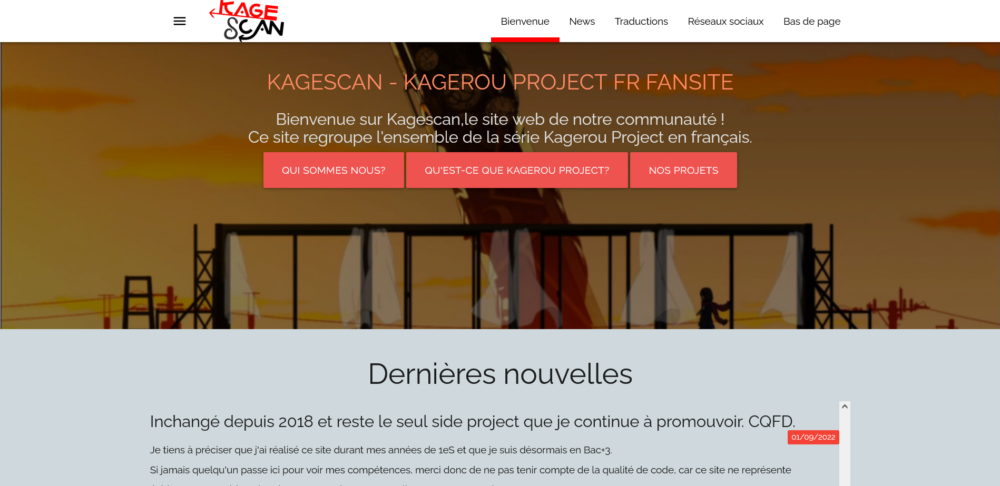
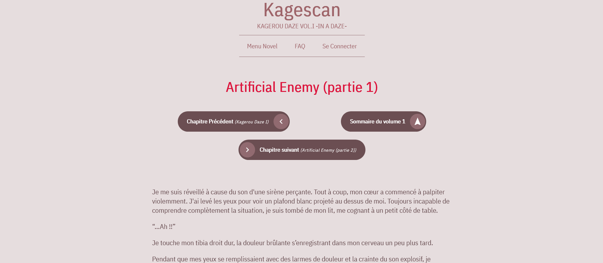
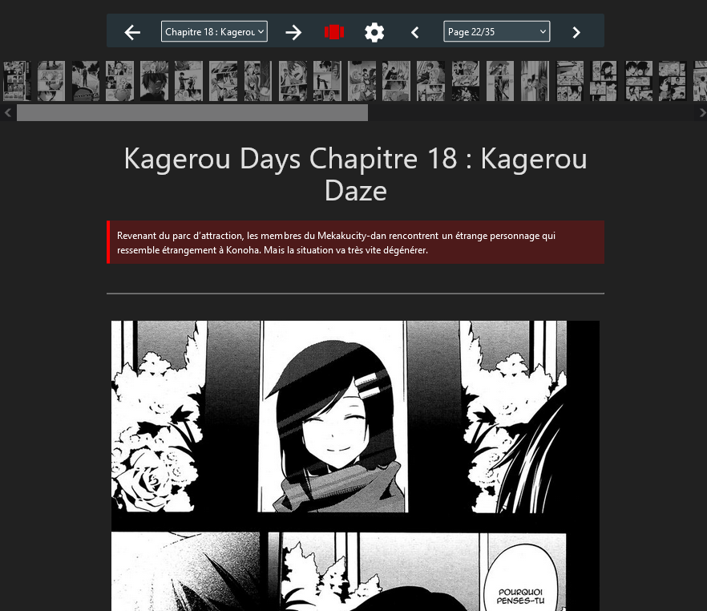
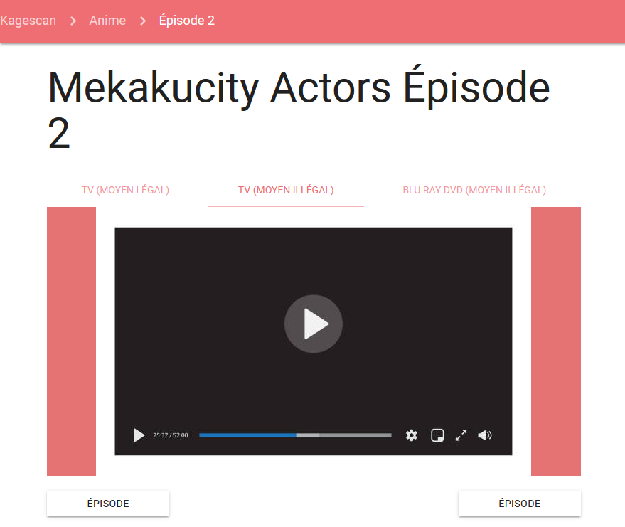
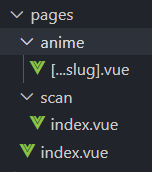

\hypersetup{colorlinks=true, allbordercolors={0 0 0}, pdfborderstyle={/S/U/W 1}}

Kagescan est un de mes premiers projets personnels. Il s'agit d'un site web hébergant des traductions de romans, mangas et séries animées. Il est également doté d'un panel d'administration, permettant de publier dynamiquement de nouveaux chapitres.

{width=4in}

Démarré en février 2017 _(déjà 6 ans ?)_, le site a été développé avec PHP 7.0, MySQL et Jquery. Profiter du module de Dev. Web pour le réécrire me permettra de mettre en pratique tout ce que nous avons vu en cours tout en s'amusant.

# 1) Fonctionnalités attendues

## a) Page d'accueil et pages info

Juste une suite de pages statiques. L'objectif est de faire à minima une page d'accueil.

## b) Section romans

Dans un roman, on caractérise un chapitre comme :

-   Contenu : du texte richement formaté
-   Des métadonnées (titre du chapitre, traducteur, résumé...)
-   Une hiérarchie parentale (En effet, un chapitre appartient à un volume, qui lui-même appartient à une série)
-   Une page suivante et précédente : Il s'agit du chapitre suivant, sauf pour le premier et dernier chapitre du volume (dans ce cas, on passe respectivement au dernier/dernier chapitre du volume suivant/précédent)

On peut donc imaginer une hiérarchie de route comme celle-ci : `/novel/:nomSerie/:nomVolume/:nomChapitre`.

{width=80%}

## c) Section mangas et séries animées

Le fonctionnement est sensiblement identique aux romans pour les deux autres sections. La seule différente est que :

-   Les chapitres de mangas sont composés d'une suite d'images (pages de manga).
    -   Tout comme un chapitre de romans est un simple texte formaté, un chapitre de mangas est un diaporama d'images.
-   Les séries animées sont composées d'une suite d'épisodes. Ainsi, le contenu d'une entrée d'épisode est une vidéo.
    -   Petite particularité sur les vidéos : Le site doit supporter différents serveurs de vidéo. On doit donc être capable d'afficher une vidéo youtube (`<iframe>`) ou une vidéo hébergée sur un serveur personnel (`<video>`).

{width=50%}
{width=50%}
\begin{figure}[!h]
\caption{Apparence d'un chapitre de manga et d'un épisode d'anime}
\end{figure}

## d) Panel d'administration

Une fois toutes les sections réalisées, il serait intéressant de pouvoir publier dynamiquement des chapitres. Pour cela, il faudrait un panel d'administration.

L'unique base de code doit être capable de supporter les différentes sections (romans, mangas, vidéos). Il faudra donc être capable de fournir une couche d'abstraction pour les différentes sections.

# 2) Technologies employées et architecture logicielle

Le projet sera entièrement conçu sur **Nuxt.JS v3**. C'est le framework full-stack officiel de Vue.JS (il intègre un client vue.js et permet la programmation de son propre serveur web dans le même projet). Il est adapté pour des projets de taille moyenne tels qu'un site web centré sur le contenu.

Le projet sera développé sur **Visual Studio Code**. Même si j'utilise IntelliJ Idea au travail, VSCode est l'éditeur ayant le meilleur écosystème de développement sur Vue. Il est également gratuit.

## a) Front-end

Le front-end sera développé en **Composition API** (Vue.JS v3). En plus des composants, nous introduisons la notion de composables (logique réutilisable) et le support du Typescript.

Référence de la composition API : [Vue.js doc: Composition API FAQ](https://vuejs.org/guide/extras/composition-api-faq.html#more-flexible-code-organization)

## b) Back-end

Le routing est géré automatiquement par Nuxt. Il suffit de créer des composants vue.js dans le dossier `pages` pour créer des routes. Dans l'illustration suivante, se rendre à l'URL `/scan` affichera le composant `/scan/index.vue`.

Nouveauté de la version 3 de Nuxt : pouvoir développer son API backend avec **Nitro**, qui est inclus dans le framework.

On peut finalement apparenter Nuxt.JS comme le "PHP de Node.JS", car il permet de créer des projets monolithes très facilement.

Référence : [NuxtJs doc : Server engine](https://nuxt.com/docs/guide/directory-structure/server#example)

## c) Base de données

Pour la base de données, l'usage d'une **base de données NoSQL orientée documents** (tel que MongoDB) sera choisie.

En effet, elle convient parfaitement à notre besoin : système de hiérarchie, un document est composé de métadonnées, peu de jointures, schéma différent selon les catégories impliquées (romans, mangas, séries animées).

En revanche, quitte à faire du monolithique, nous n'allons pas s'embêter à installer MongoDB. À la place, **nous utiliserons [Nuxt Content](https://content.nuxtjs.org/guide/displaying/querying)**, une extension officielle créée par les développeurs de Nuxt.  
Plutôt que d'utiliser une base de données, Nuxt Content utilise des fichiers markdown et des headers YAML pour stocker données et métadonnées. De la même manière qu'un ORM, cette librairie offre une couche d'abstraction pour requêter notre donnée sans même savoir que nous manipulons des fichiers.

# 3) Perspectives d'amélioration

-   Ajout d'une section "musiques" (héberge des albums et stocke des lyrics)
-   Système de commentaires (qui s'accompagne par un système de comptes)
-   Notifications de nouveaux articles via webhooks ou mail
